# Homework 4: Code Quiz

## Description
This repository holds the fourth homework assignment for [The Coding Boot Camp](https://techbootcamps.utexas.edu/coding/) through the University of Texas at Austin's Center for Professional Education.

This project used JavaScript to create an app that ran through a quiz. This project used a responsive website design through bootstrap and questions that were generated through the use of JavaScript to populate as a user interacted with the quiz. It highlights the use of changing display settings through functions, running functions that would populate the questions and answer choices through an array of objects, if statements to check the conditions of the answer clicked, timer functions to run the quiz but also take away time if an answer was incorrect, as well as local storage to store a users initials and scores.

## Notes
Here are some of the items that were of note in completing this project:

* Setting up the questions, answer choices, and correct answer as an array of objects.
    > 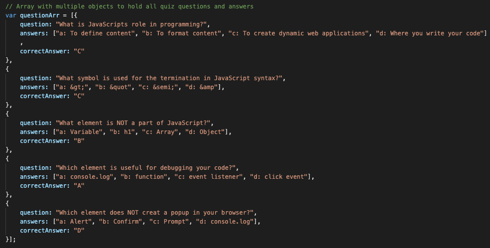

* Setting global variable to be accessed throughout the various functions.
    > 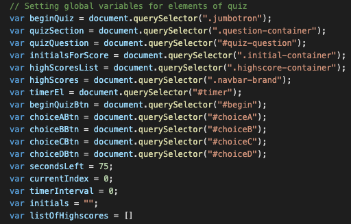

* Using various click listeners for the buttons to start the quiz as well as choosing the answers which were then compared to the correct answer in the questions array using the value stored in the dataset.
    > 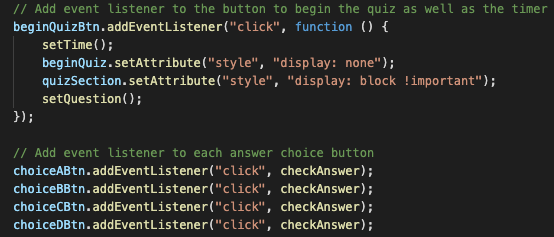

## Page Screenshots
Page with Begin Quiz container shown and Quiz Question container hidden
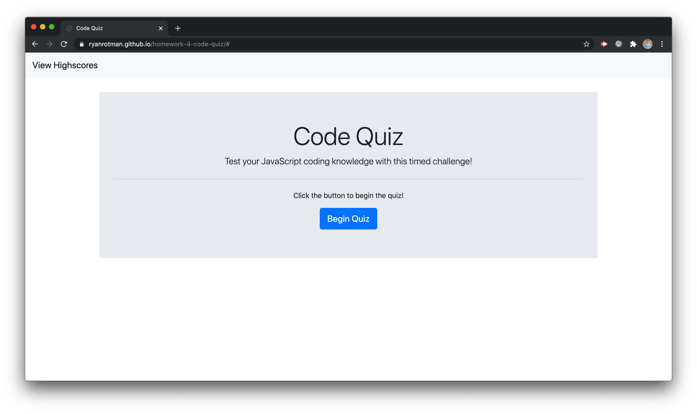
Page with Begin Quiz container hidden and Quiz Question container populated with Question 1
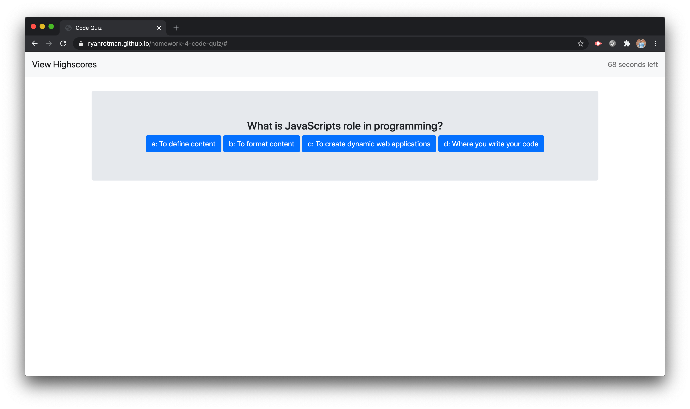
Page with Begin Quiz container hidden and Quiz Question container populated with Question 2
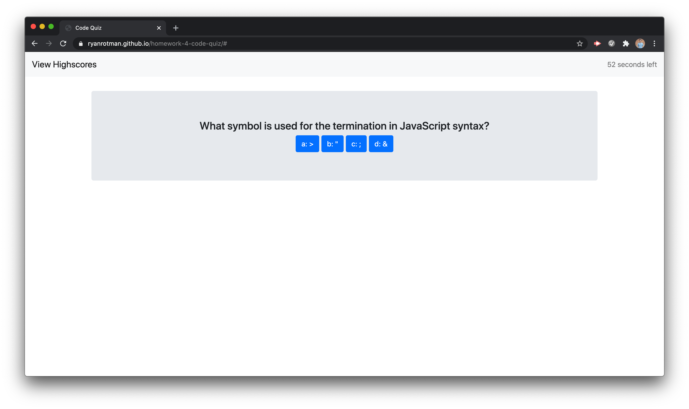
Page with Begin Quiz container hidden and Quiz Question container populated with Question 3
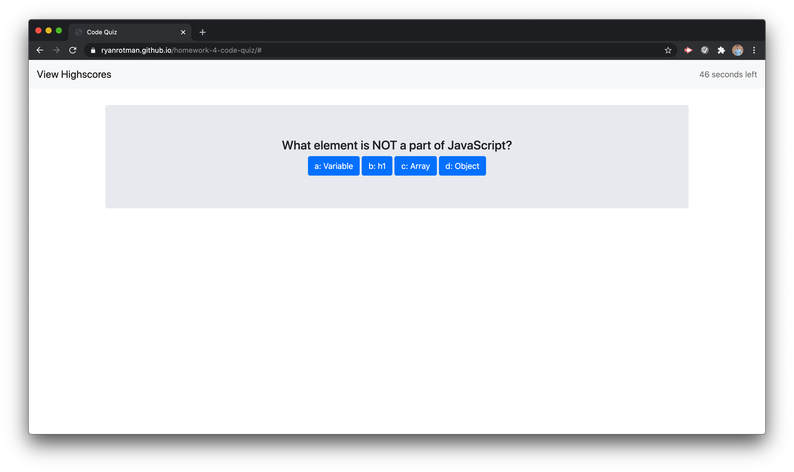
Page with Begin Quiz container hidden and Quiz Question container populated with Question 4
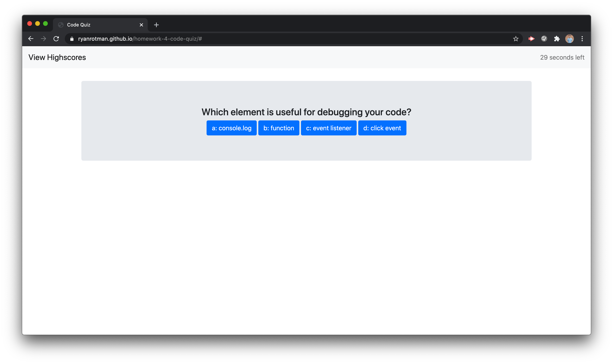
Page with Begin Quiz container hidden and Quiz Question container populated with Question 5
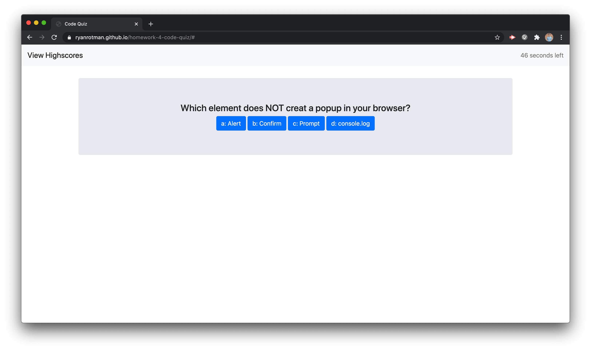
Prompt for User to input their initials for score
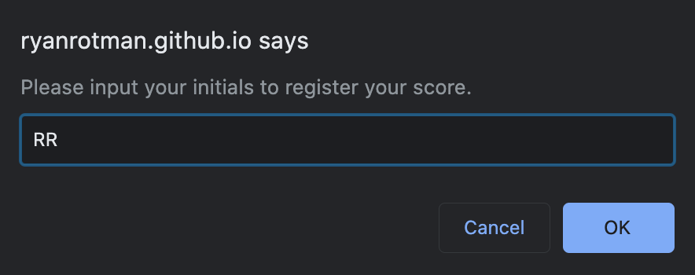
Initials and Score stored in the inspector
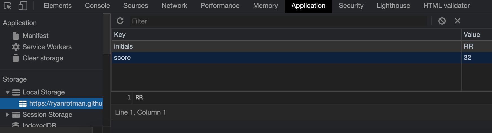

## Link
Github Pages Link: [https://ryanrotman.github.io/homework-4-code-quiz/](https://ryanrotman.github.io/homework-4-code-quiz/)